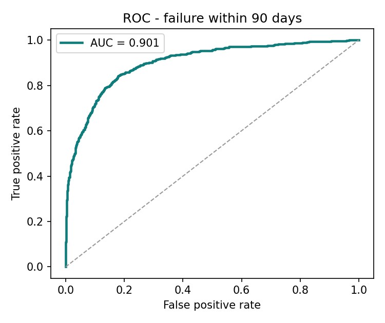
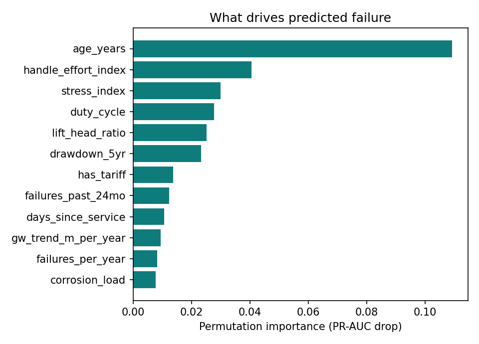

# JalRakshak 💧

**Predicting which rural water points will break down — and deciding which ones the crew should fix first.**

[](https://github.com/Sarthakgupta05/jalrakshak/actions)
[](LICENSE)

### ▶️ **[Open the live demo](https://Sarthakgupta05.github.io/jalrakshak/)**

The demo is the real trained model, exported to JSON and running in your browser.
No server, no API key, works offline. A [test](tests/test_demo_parity.js) proves the
JavaScript reproduces scikit-learn to 1.2 × 10⁻⁹.

---

## The problem

Across rural India roughly **one water point in five is non-functional at any moment**.
The failure itself is rarely the disaster — the *delay* is. A handpump breaks, nobody
reports it for a week, the mechanic is 60 km away, and a village of 800 people walks
to a contaminated pond for three weeks.

Districts already collect the data that predicts these failures: asset age, borehole
depth, water-table trend, service history, complaint logs, water chemistry. Nobody
uses it. Maintenance stays **reactive** — you fix a pump after it has already failed.

## What JalRakshak does differently

Most predictive-maintenance projects stop at a risk score. A risk score does not help
a block engineer who has **one crew and 120 crew-days per quarter**. JalRakshak has
two stages:

**Stage 1 — Risk.** A gradient-boosting model estimates the probability that each
water point suffers a service-stopping failure within 90 days.

**Stage 2 — Triage (the part that matters).** Risk is converted into a *plan*:

```
expected_loss = P(failure) × people_served × days_the_village_stays_dry
benefit       = expected_loss × 0.70          (a preventive visit is not a cure)
cost          = crew-days to travel there and service it
```

then a **0/1 knapsack under the crew-day budget** picks the subset of water points
that protects the most **person-days of water access**. The objective is human, not
statistical: not "catch the most failures" but "keep the most people in water".

This is why the system beats a pure risk ranking. A 95 %-risk pump serving 40 people
that is 90 km down a bad road loses to a 55 %-risk pump serving 1,100 people that is
8 km away. The optimiser knows that. A leaderboard-chasing classifier does not.

## Results

**Stage 1 — held-out test set (2,400 water points, 17.9 % failure base rate)**

| Model | ROC-AUC | PR-AUC | Brier |
|---|---|---|---|
| Logistic regression | 0.907 | **0.749** | 0.124 |
| Random forest | 0.888 | 0.704 | 0.090 |
| Hist gradient boosting | 0.887 | 0.708 | 0.089 |
| **Gradient boosting (selected)** | 0.901 | 0.741 | **0.083** |

Logistic regression edges out on PR-AUC but is badly calibrated (Brier 0.124) because
class re-weighting inflates its probabilities. Stage 2 *multiplies the probability by
population*, so a miscalibrated model misallocates real crews. The selection rule is
therefore: **shortlist everything within 2 % PR-AUC of the leader, keep the
browser-deployable ones, pick the best calibrated.** Gradient boosting wins on merit.

Operating point (threshold 0.11, chosen by expected field cost, not 0.5):
**88 % of failures caught**, precision 0.44, **3.5× lift in the top 20 %**,
5-fold CV PR-AUC 0.692 ± 0.017.

**Stage 2 — same 120 crew-days, same 1,500 water points, only the ranking changes**

| Policy | Failures caught | Hit rate | Person-days of water protected |
|---|---|---|---|
| Random | 33 | 17 % | 96,007 |
| Oldest first | 96 | 52 % | 241,193 |
| Most complaints first | 105 | 57 % | 253,837 |
| Largest village first | 59 | 31 % | 318,308 |
| **JalRakshak** | **121** | **68 %** | **494,915** |

**+55 % more water access protected than the best heuristic a district uses today, and
5.15× random — for exactly the same budget.**

Note that JalRakshak visits *fewer* points (177 vs 185) and still protects twice the
access. That is the knapsack trading cheap-but-useless visits for expensive-but-vital ones.

 

## What the model learned

Permutation importance ranks the engineered features near the top, which is the
evidence that domain knowledge — not raw columns — is doing the work:

1. `age_years` — mechanical wear
2. `handle_effort_index` — a phone-loggable proxy for pump strain
3. `stress_index` *(engineered)* — duty cycle × √lift; the core mechanical load
4. `duty_cycle` — demand against design capacity
5. `lift_head_ratio` *(engineered)* — how much of the borehole is dry column
6. `drawdown_5yr` *(engineered)* — projected water-table fall
7. `has_tariff` — governance beats hardware; villages that collect a tariff fail less
8. `failures_past_24mo` — failures cluster

## About the data

The dataset is **synthetic but causally grounded**, and the repo is honest about it.
The real analogue is the Taarifa / DrivenData *Pump it Up* registry plus state IMIS
asset data; those are open but not redistributable inside a hackathon repo. So
[`src/generate_data.py`](src/generate_data.py) encodes the documented failure physics
instead — super-linear wear with age and duty cycle, stress from a falling water table,
corrosion from iron and TDS, escalation when the workshop is far away, governance
effects from tariffs and trained caretakers, and clustering of repeat failures.

It is deliberately not easy: the signal is spread across interacting drivers, 6 % of
sensor readings are missing, the intercept is auto-solved to the field-reported 18 %
base rate, and Gaussian noise caps achievable performance around 0.90 AUC. Swap in a
real district CSV with the same column names and every script runs unchanged.

## Architecture

```
generate_data.py → features.py → train.py ──→ models/model.joblib
                        │                          │
                        │                          ├─→ export_model_js.py → docs/model.json
                        │                          │        (asserts parity with sklearn)
                        │                          │
                        ├──────────────────────────┴─→ triage.py  (knapsack optimiser)
                        │                                   │
                        │                                   ├─→ app/api.py    (Flask REST)
                        └─── mirrored in JavaScript ───────→ build_demo.py → docs/index.html
```

`features.py` is the single source of truth for feature engineering, and the demo's
JavaScript mirrors it line for line — which is exactly what the parity test checks.

## Quick start

```bash
git clone https://github.com/Sarthakgupta05/jalrakshak.git
cd jalrakshak
pip install -r requirements.txt

bash run_all.sh          # regenerates data, model, figures, demo and runs all tests
```

Then open `docs/index.html` in any browser. That is the whole demo — one file, no build step.

**Score a CSV**

```bash
python src/predict.py data/waterpoints.csv --top 20 --out reports/ranked.csv
```

**Run the API**

```bash
python app/api.py      # http://127.0.0.1:8000

curl -X POST http://127.0.0.1:8000/predict -H 'Content-Type: application/json' -d '{
  "source_type":"handpump_india_mk2","power_source":"handpump","management":"unmanaged",
  "age_years":18,"depth_m":90,"static_water_level_m":62,"gw_trend_m_per_year":1.6,
  "population_served":900,"duty_cycle":1.5,"water_tds_ppm":2400,
  "distance_to_workshop_km":70,"days_since_service":900,"failures_past_24mo":5,
  "mean_repair_delay_days":30,"season_month":5}'
# {"action":"schedule preventive visit","band":"high","risk_90d":0.9844}
```

`POST /triage` takes `{"budget": 40, "waterpoints": [...]}` and returns the ranked
repair plan for that budget.

## Tests

```bash
pytest -q tests/test_pipeline.py     # 13 tests
node tests/test_demo_parity.js       # browser ↔ scikit-learn parity
```

The suite goes beyond "does it run": it checks the generator is deterministic and hits
its target prevalence, that single-row and batch scoring agree, that **predicted risk
actually rises when a pump is neglected** (a sanity check on causal direction), that
the knapsack never exceeds its budget, that triage beats every heuristic, and that the
shipped browser model matches sklearn.

## Repository layout

```
src/generate_data.py     causally-grounded dataset generator
src/features.py          feature engineering — single source of truth
src/train.py             model comparison, calibration, cost-based threshold, figures
src/triage.py            knapsack optimiser + policy benchmark
src/export_model_js.py   sklearn → JSON, with a parity assertion
src/build_demo.py        inlines model + data into one self-contained HTML file
app/api.py               Flask REST API
docs/index.html          the live demo (GitHub Pages serves this folder)
tests/                   pytest suite + Node parity test
presentation/            hackathon deck
reports/figures/         ROC, PR, calibration, confusion matrix, importance
```

## Honest limitations

- The data is synthetic. Numbers demonstrate that the *method* works; they are not a
  field trial, and we do not claim otherwise.
- 70 % preventive effectiveness is an assumption, not a measurement. It scales the
  headline person-days linearly — the ranking of policies is unaffected.
- Travel cost is straight-line distance ÷ 26 km/h, not real road routing.
- No fairness audit yet. Population weighting could systematically deprioritise very
  small hamlets; a per-capita floor constraint is the obvious next step.

## Roadmap

- Survival analysis (time-to-failure) instead of a fixed 90-day window
- A tiny offline PWA for field technicians — the model is already 135 KB of JSON
- Equity constraint in the knapsack so small hamlets cannot be starved
- Ingest real IMIS / Jal Jeevan Mission asset registries

## License

MIT — see [LICENSE](LICENSE).
